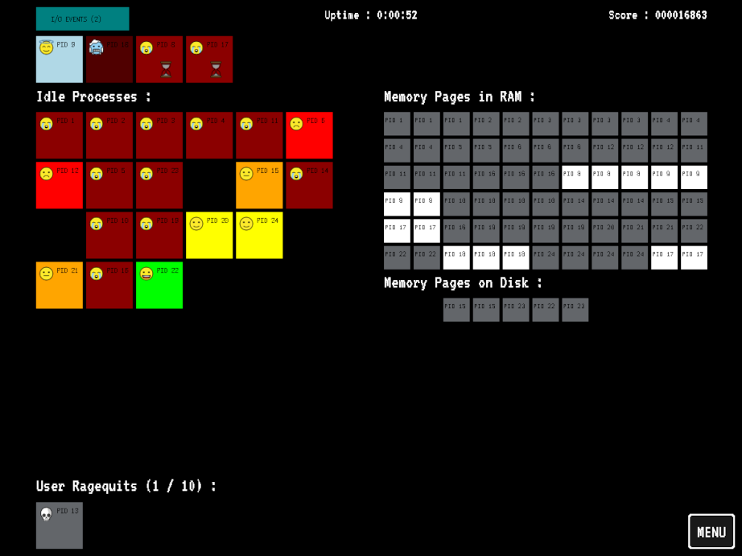

# You're the OS!

This is a game where you are the operating system of a computer.
As such, you have to manage processes, memory and I/O events.
Make sure not to leave processes idling for too long, or the user will get really impatient and reboot you!

You can play the game here: [https://plbrault.github.io/youre-the-os](https://plbrault.github.io/youre-the-os)

Also available on [itch.io](https://plbrault.itch.io/youre-the-os).



## Prerequisites

* Python 3.12
* [pipenv](https://pypi.org/project/pipenv/)
* An empty `.venv` directory at the root of the project

## Usage

***The main branch can be unstable. For a stable version, checkout a release tag.***

**Install dependencies:**

```bash
pipenv sync --dev
```

**Run as a desktop app:**

```bash
pipenv run desktop
```

**Run web version:**

```bash
pipenv run web
```

**Run with an automated script:**

_(Implemented by [@Wiguwbe](https://github.com/Wiguwbe))_

```bash
pipenv run auto <script.py> [args]
# to get all the available options
pipenv run auto --help
```

See `automated_skeleton.py` for more info on API.

**Build web version without running:**

```bash
pipenv run web build
```

**Create `web.zip` archive for itch.io:**

```bash
pipenv run web archive
```

**Run linter:**

```bash
pipenv run pylint
```

**Run unit tests:**

```bash
pipenv run pytest
```

## License

Copyright © 2023-present Pier-Luc Brault <pier-luc@brault.me>

This program is free software: you can redistribute it and/or modify it under the terms of the GNU General Public License as published by the Free Software Foundation, either version 3 of the License, or (at your option) any later version.

This program is distributed in the hope that it will be useful, but WITHOUT ANY WARRANTY; without even the implied warranty of MERCHANTABILITY or FITNESS FOR A PARTICULAR PURPOSE. See the GNU General Public License for more details.

You should have received a copy of the GNU General Public License along with this program. If not, see <https://www.gnu.org/licenses/>.

## Asset Licenses

* The game icon/logo is a modified version of an image by [Muhammat Sukirman](https://thenounproject.com/creator/zero_wing/) published under the [Creative Commons Attribution License 3.0](https://creativecommons.org/licenses/by/3.0/).
* Emojis used in the game are from [OpenMoji](https://openmoji.org/). They are published under the [Creative Commons Attribution-ShareAlike License 4.0](https://creativecommons.org/licenses/by-sa/4.0/).
* The image used in the Game Over screen is by [Aleksandar Cvetanović](https://pixabay.com/fr/users/lemonsandtea-10190089/). It was published on Pixabay prior to January 2019, and as such, is available under the [Creative Commons Zero (CC0) License](https://creativecommons.org/publicdomain/zero/1.0/?ref=chooser-v1) according to Pixabay's Terms of Service.
* The primary font used in the game is named *VT323*, and was designed by Peter Hull. The secondary font is named *Victor Mono* and was designed by Rune Bjørnerås. Both are published under the [Open Font License](https://scripts.sil.org/cms/scripts/page.php?item_id=OFL_web).
